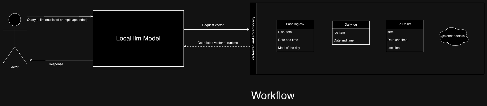
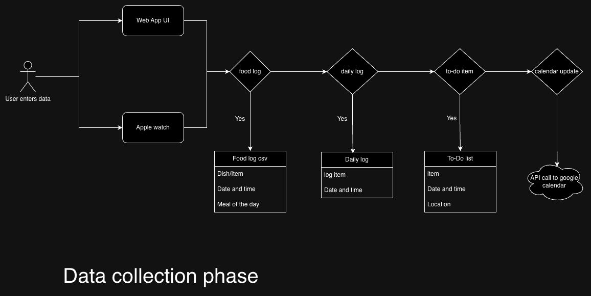

# PersonalAssistant
A personal assistant to help me recollect things, remember and summarize various events- small and big.

As a user I want to be able to:
1. Must haves:
    1. Be able to set goals effortlessly.
    2. See my progress with these goals. Preferably a dashboard with the ability to easily add new data. Major types of goals I am interested are:
        1. Sleep goals - apple watch
        2. Habit tracker - manual feed through apple watch shortcut
        3. Health goals - Health app and shortcut manual feed
        4. Exercise goals - health app
        5. Food tracking
        6. Learning goals - manual through watch
    3. Be able to manage my calendar and remind me.
    4. Remember things for me.
        1. To-do lists

2. Good to haves:
    1. Based on my data, personalised recommendations of what I should do, help build a calendar for me directly. – (end goal)
    2. Favourite songs, movies etc
    3. Summaries of things I have read. (point 4)
    4. Favourite quotes (point 4)

Implementation strategy:

1. To set goals -> Capture goals in a document and feed it. Completely manual, done every few weeks/months.
2. Sleep goals -> explore automation of exporting key sleep data automatically.
3. Habit tracker -> Set manually in a csv file. Habit occurrence tracked by manual addition into a csv using apple watch automation.
4. Health goals -> eg weight, bmi, body fat percentage etc
5. Food tracking -> 
    1. Master csv with all recipes, macros and calories
    2. Another csv with each food item entered through apple watch automation
6. Learning goals -> manual tracking into a csv file.
7. Manage calendar -> look for ways to integrate google calendar with APIs.

